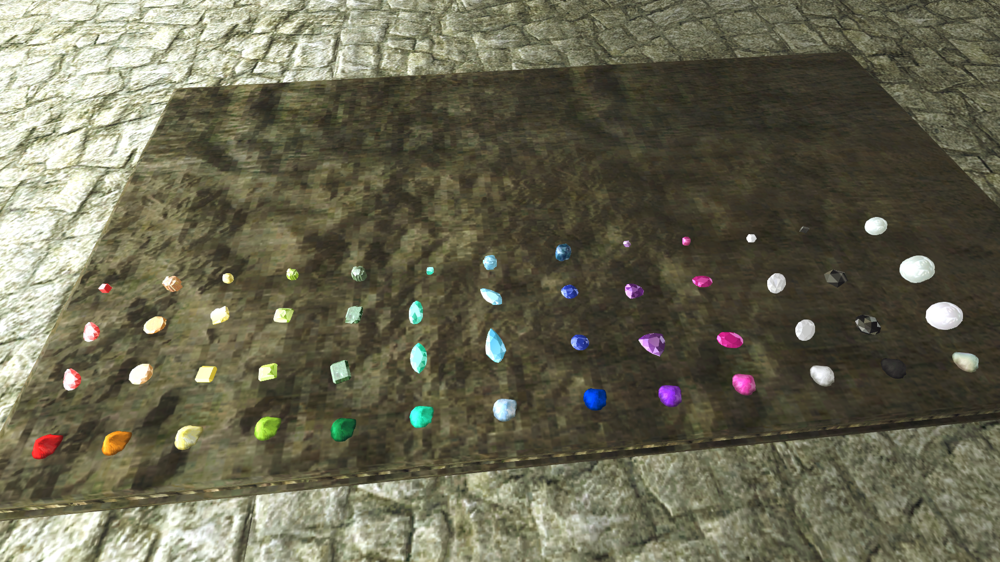

# A Rainbow of Treasures

This mod adds 7 new gems in 3 different qualities to the game:   
**Amethyst**, purple    
**Aquamarine**, light blue   
**Citrine**, yellow  
**Onyx**, black  
**Peridot**, light green  
**Spinel**, pink  
**Tourmaline**, turquoise  

If you own a mortar and pestle you can grind all new and vanilla gems, as well as pearls, to dust by right clicking on a gem in your inventory. A container will open, you place the gems inside, close it and receive your dust. Yes, your novice mortar and pestle is strong enough to grind diamonds. It's magic.
Gem dust has different alchemical uses, pearl dust only offers water breathing.
Low quality gems will give 1 dust, medium quality gems will give 2 dust and high quality gems will give 3 dust. Depending on the quality of your tool, there is a small chance to recieve bonus dust. 

Gem qualities have been normalized and renamed: Tiny, Rough and Flawless. All gem leveled lists for loot have been unlevelled. Some merchants selling ingredients have a chance of selling gemdust.

There is a small chance to find gems in silver and gold veins, and both types of veins now respawn. 
Since there is now a (small) use for pearls, clams respawn as well. 

Lastly, many gems have been placed throughout the world, so they aren't just found in chests and loot.

