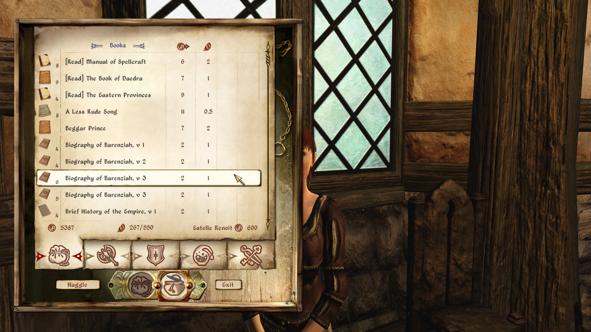

# Bookworm

This mod allows you to mark books as read by right clicking on them, either in your inventory or while reading them. A menu will allow you to mark or unmark them as read, by adding [Read] to the start or at the end of the book's name, according to your settings.
[Read] The Lusty Argonian Maid or The Lusty Argonian Maid [Read]

If you want, this mod can mark books as read as soon as you reached the last page, and mark letters, notes, scrolls etc as soon as you open them. You can turn this on individually in the ini.

You can also turn on the marking of Skill Books, by adding the [Taught Skill] as suffix.
The Lusty Argonian Maid [Blade]

Lastly, this mod allows you to pick up Skill Books without reading them, saving them for later.
Both, the marking of taught skills and the pickup option will be disabled for a book once you've read it and learned the skill.

This works with all books, vanilla and mod added. The only exception is the pickup option for scripted & quest object skill books, like the Mythic Dawn Commentaries. Those will not give the option to pick them up, since they usually need to be read for quest progress.

