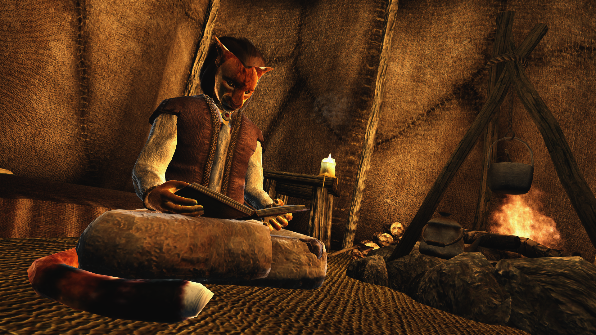

# CTAddPose Custom esp

A custom esp made from a CTAddPose mod that allows changes of everything - animations, anim items, menu names - from xEdit for easy copy and paste.   
It basically has a misc item for each pose in the menu, which is read as that menu entry - no need to touch the script at all if you want to change pose 23 from "sitting on a rock" to "falling off a cliff".  

The tutorial for this can be found [here](http://www.shrine-of-kynareth.de/making-your-own-one-mod-pose-collection).
