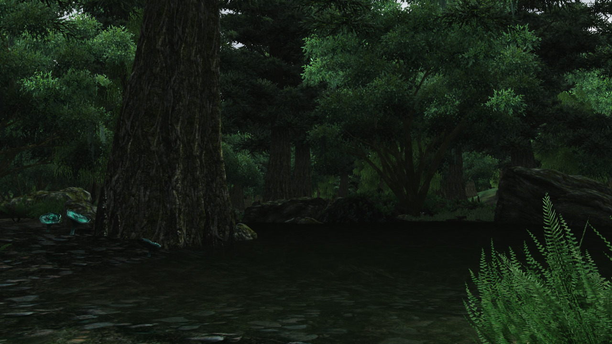

# Calm Water

When I wasn't using OR, I tried to change the water a bit. I was using Enhanced Water before, but I wanted a bit more transparency (even if it looks weird at large bodies of water where the currently loaded cells end).

Not too successful, vanilla water shader is pretty meh. I added green swampy water to the blackwood swamp areas (not compatible with UL parts of that area), and crystal clear water to mountain lakes.

It's definitely not pretty enough to be released and I am currently not working on it/using it, because I use OR again.
