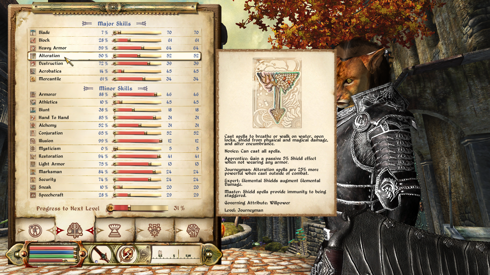

# Display Skill Perk Effects

This mod takes the idea of Alek's skill perk descriptions to the next level. While the original mod just displayed static texts, this mod was written from scratch to take into account all available game settings. Have a mod that changes sneak damage multiplier or light armor perk bonuses? No problem. In some cases, it will (at least try, lol) to print fitting text: For example if heavy armor encumbrance is 0, it will display "does not encumber", while if a mod changes the multiplier to something like 50%, it will say "encumbers only 50%."

For some mods it also displays additional perks. Mods currently supported are (some effects will only be displayed if enabled in those mods):

- Maskar's Oblivion Overhaul
- Av Latta Magicka
- Oscuro's Oblivion Overhaul
- Skill based harvest chance
- Vanilla Combat Enhanced
- Supreme Magicka
- Bashing Reworked
- Maskar's Unarmored Skill
- Fundament Enchanting Addons
- Pickpocket Skill Overhaul
 

