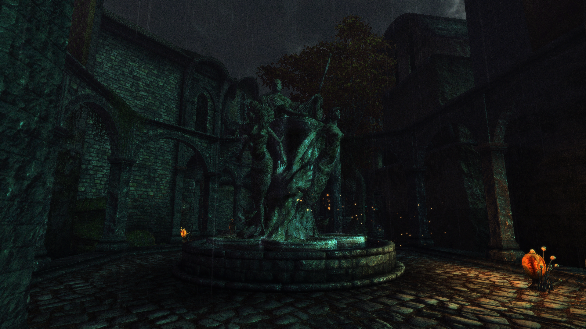

# Dynamically Adjusted Darkness

This mod alters the night colors of each current weather (vanilla or mod added) to be a bit darker according to ini settings. Brighter is possible as well, but might not give great results, as often very dark nights have very low value and multiplicating 2 with 2 will still be very dark.   

Darkness can be set independently for Shivering Isles and Tamriel. The mod checks the GetPlayerInSEWorld variable. 

Probably won't be releasing this, as it feels pretty pointless. Afaik, all weather mods already include darker night options, except for NAO, which is super dark anyway.
