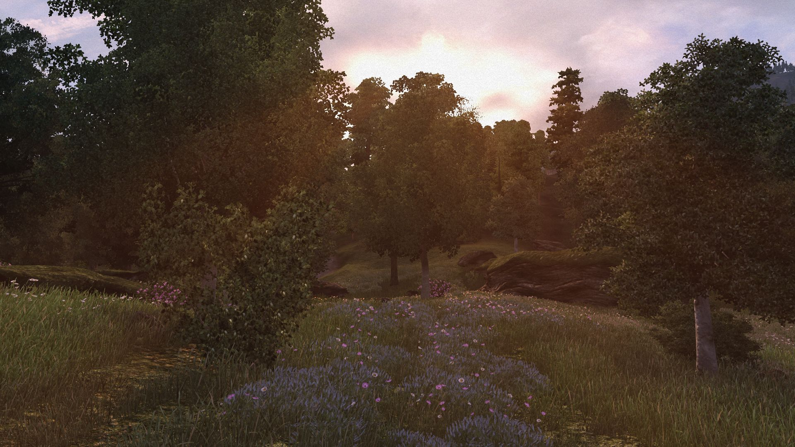

# Let there be Flowers

This mod adds some flowers to a few ground textures.   
- The Gold Coast will get red and yellow poppies.   
- Autumn forest around the Orange Road will get flowers in red/yellow hues.  
- The Heartlands and other plain green meadows will get daisies.  
- The Colovian Highlands will get a colorful mix.   
- The West Weald will get purple and blue flowers.   
- The Paradise will get bluebells.  
- Mania will get yellow and red poppies.  
- No flowers were added to snowy and swampy areas.  
