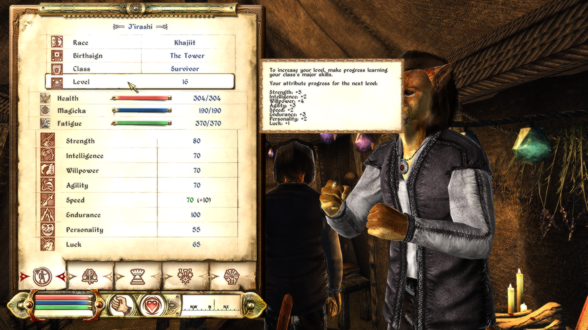

# Morrowind-like Leveling

This mod gives you the possibility to still get attribute bonuses even after the game prompted you to sleep. You're at 4 points for intelligence when you accidentally hit a levelup? No longer a problem.
It can also handle retroactive health, removing the need to level up endurance as fast as possible.

Another more or less minor feature of this mod is to allow minor and specialization skills to have impact on your level progress. This is off by default but the settings are explained in the ini file.
This doesn't have anything to do with Morrowind, but that's what I was trying to make when I found the other feature, so I left it in.

This mod can be installed without problem on vanilla characters or on a new game. Please make sure to not have outstanding levelups when you install this mod (no sleep symbol on the hud, experience bar to next level not full, you get it.)
If you previously had another leveling mod on that character, please follow the detailed instructions in the install section below.
