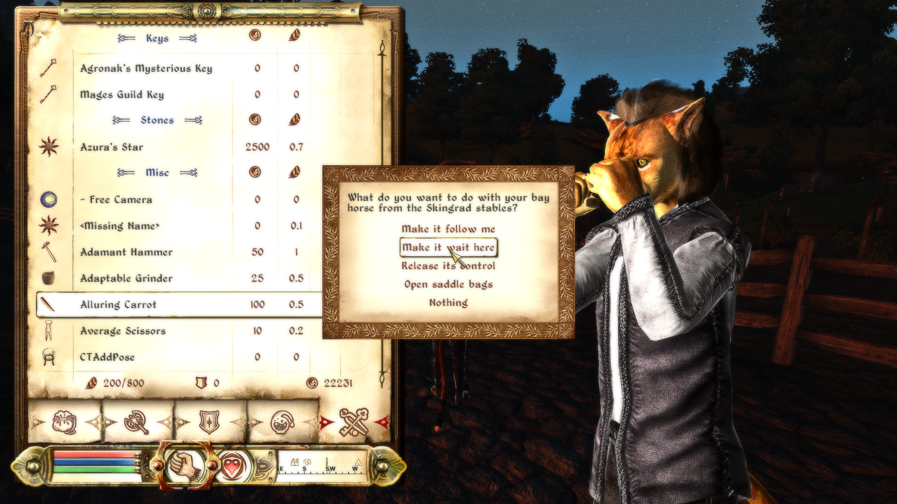

# Nameless Overhaul

There are a lot of other Overhauls out there already and they all do their job well. I've used some of them in my years of playing and I currently love Maskar's Overhaul. In fact, I copied a few ideas from MOO because they were just too good and I didn't want to live without (bandages and imbuement say hi). If you enjoy having new things in your game (mostly enemies and gear) there is no reason to even look at this, because almost everything my overhaul does has been done before.

However, there was a certain thing I just couldn't find. Whenever someone asks for a simple way to remove the bandits in glass armor and disappearing skeletons, I didn't know what to suggest that didn't change too much on top of that. I always imagined a mod that keeps vanilla leveling but just cuts it off at some point, while removing the non combat related nonsense scaling. No more need to reach level 15 to find diamonds. Bandits spawn like normal, but just don't get the rarer gear. You won't be ambushed by a mountain lion on level 1, but you will still find normal wolves on level 20.

Now, to be fully honest, I also do "more". I guess that's the nature of modding.    
I tried to keep the new features out of the way, when possible. Most "tools" have to be bought and explicitly used and no non-vanilla assets were used.   

My main goals were:    

- No OBSE required 
- Attempting to stay close to vanilla
- No additional files beside the .esp(s) required
- Vanilla scaling, but no more vanishing rats or endlessly scaling goblins
- Fixing all the instances of having to look up optimal levels like quest rewards
- Adding a few quality of life feature, like crafting lockpicks or unlocking spellmaking
