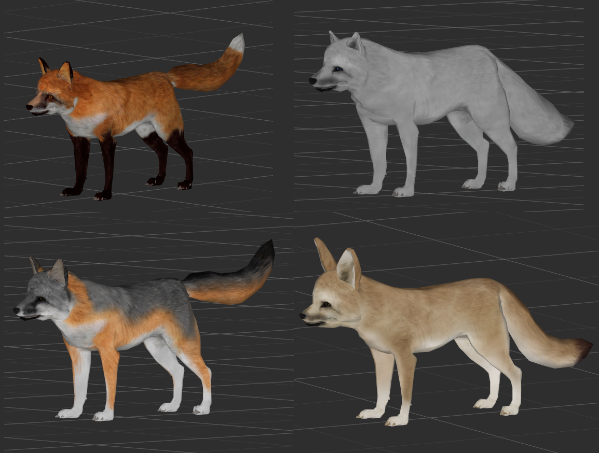

# Resource - Fox Variations

I like foxes, so I wanted *more* foxes. I also added this to my MOO install, so this is only meshes and textures, no esp. This is files for a desert fox, a grey fox, a better red fox and a polar fox.   

This resource uses Oblivion meshes, so it cannot be converted to work with other games.     
If you use it, a small credit would be nice, especially to the original author's work.    
If you put your files into a BSA, please consider changing the mesh/texture paths.     

Credits: This is based on the fox mesh from mr_siika. [Link on Nexus](https://www.nexusmods.com/oblivion/mods/14267).
