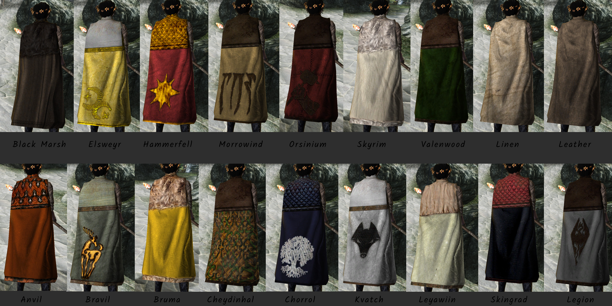

# Resource - Regional Capes

When playing with MOO, I didn't like that the faction capes were plain colors, so I made alternatives for my game. For the fun of it, I then added capes to city guards as well.   
The capes for regional factions come as cape or cloak, while the guards only get capes.    
This is only a resource, no esp.   

This resource uses Oblivion meshes, so it cannot be converted to work with other games.     
If you use it, a small credit would be nice, especially to the original author's work.    
If you put your files into a BSA, please consider changing the mesh/texture paths.     

Credits: Base mod Capes and Cloaks by Someone1074 / Textures by Belenos. [Link on Nexus](https://www.nexusmods.com/oblivion/mods/4539).
