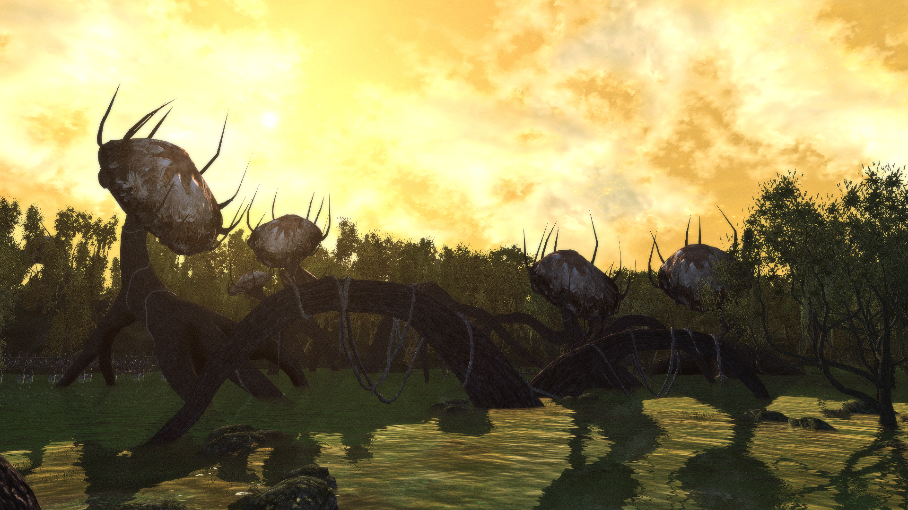

# Shivering weather mixed up

I got a bit bored with the few weathers that exist in SI. Mania and Dementia each get only like 2-4 weathers and while Dementia has more, most of them have fog. This mod:

- Allows for Mania weather to happen on the Dementia side of SI and vice versa. Chances are higher for native weather. 
- Takes a two more weathers and adds them to the rotation.
- There are now 3 clear weathers, 2 overcast weathers, 2 foggy weathers and 2 rainy/stormy weathers.
- Changes some of the existing weathers slightly.
- Makes nights roughly 50% darker.
- Uses only vanilla textures. If you use any replacers, those will be used. 
