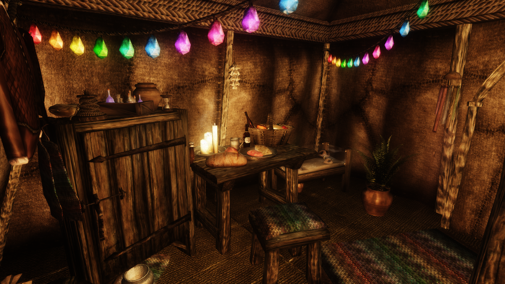

# Traveler's Tent

This is a house mod based on Simple Portable Tent by Khettienna. I've kept some features and added a few more. You can purchase the tent materials at a general merchant in evey major vanilla city:
Jensine & Thoronir (IC), Seed-Neus (Chorrol), Gundalas & Elsynia (Leyawiin), Gunder (Skingrad), Norbert Lelles (Anvil), Nilawen & Nordinor (Bravil), Suurootan (Bruma), Borba gra-Uzgash & Magra gro-Naybek (Cheydinhal). Just ask them about Camping.
As of 1.1, several mod merchants are supported as well.
Once purchased, there will be more options where you can buy additional furniture and features. The base tent for 350g only includes one bedroll, a few simple containers, a table and a chair. A fully upgraded tent will cost 6000g.   
A list of all the upgrades and their prices, as well as a description of how to use them, is pinned to the bookshelf in the tent.   
 
I made this mod for myself, because I play without fast travel and I end up rarely visiting homes that are not portable.    
I wanted to be able to purchase it early, no matter in which city I start the game.    
I wanted static stuff, because I'm not dealing with Havok in such a small space.    
I wanted it to support Basic Primary Needs and MOO's cooking.   
I wanted it to fit a lot of different types of characters.   
I wanted containers that show what would go into them.   
I wanted convenience, but I didn't want it for free.    
