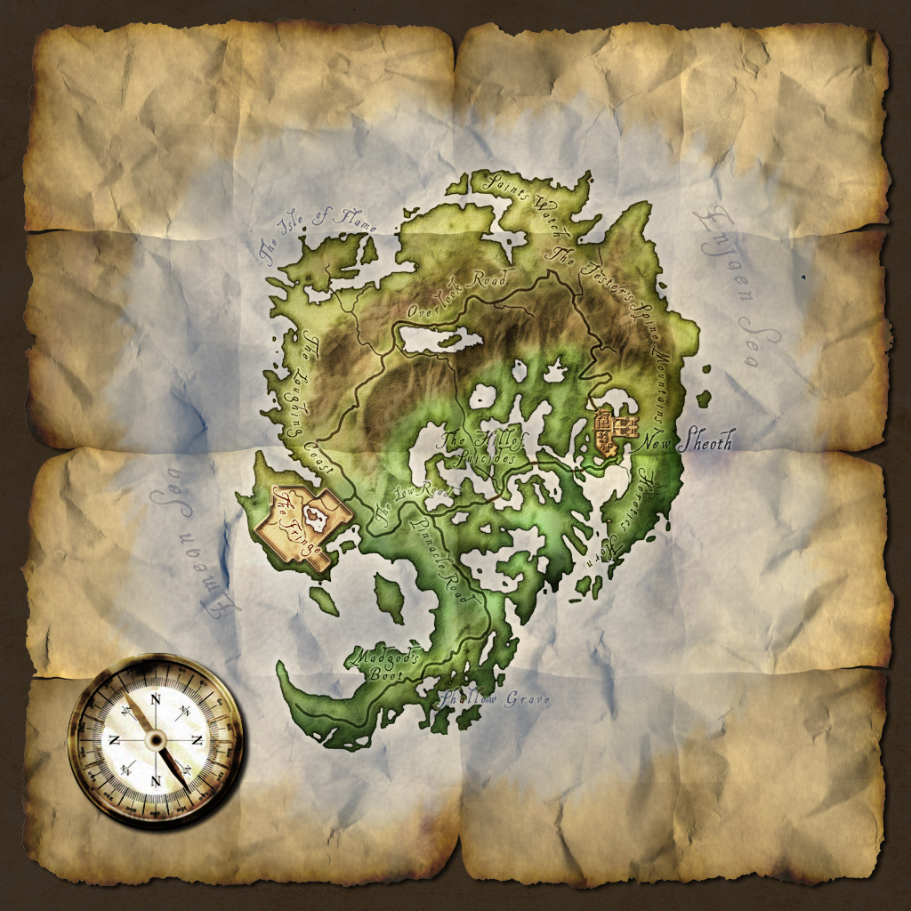

# Used Old Map for Shivering Isles

I've always used the Old Map or Improved Used Map for my Cyrodiil map and I was missing a similar option for the Shivering Isles, so I made one (or six).   

Divided = Mania uses a lighter yellowish green, Dementia a dark vibrant green    
Normal = All of the isles use the same color    
Vanilla = No color   
